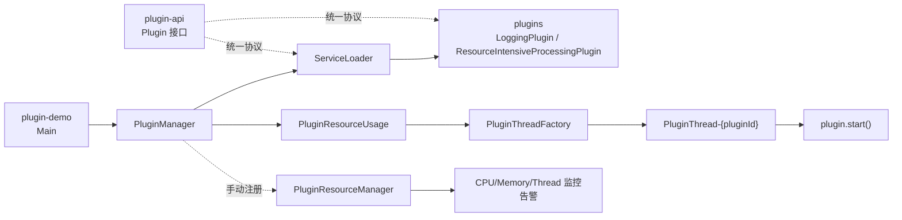

# 架构总览

## 总体流程

1. `plugin-demo` 调用 `PluginManager.loadPlugins()`。
2. `PluginManager` 通过 `ServiceLoader<Plugin>` 发现插件实现。
3. `PluginManager.startPlugins()` 为每个插件创建 `PluginResourceUsage`。
4. `PluginResourceUsage` 通过 `PluginThreadFactory` 创建独立线程并执行 `plugin.start()`。
5. `PluginResourceManager`（手动注册模式）可周期性检查资源使用并输出告警。

## 设计图（Mermaid）

## 分层说明

### 1) plugin-api

定义统一插件协议：

- `start()`：启动插件
- `stop()`：停止插件
- `isStopping()`：是否处于停止流程
- `getMemoryUsage()`：内存使用统计
- `getThreadCount()`：线程数量统计

### 2) plugin-core

#### `PluginManager`

- 使用 SPI 自动加载插件
- 维护 `pluginMap`（插件实例）和 `pluginResourceUsageMap`（线程与运行状态）

#### `PluginResourceUsage`

- 保存插件运行上下文：ID、实例、启动时间、线程
- 负责在独立线程执行插件逻辑

#### `PluginThreadFactory`

- 统一插件线程命名：`PluginThread-{pluginId}`
- 设置线程未捕获异常处理器

#### `PluginResourceManager`

- 支持手动注册插件后进行资源监控
- 检查 CPU 时间 / 内存 / 线程数阈值，超限时输出告警

### 3) plugins

- `LoggingPlugin`：周期日志输出示例
- `ResourceIntensiveProcessingPlugin`：计算密集型任务示例

### 4) plugin-demo

入口类 `org.hqf.tutorials.java.Main`：

- `loadPluginsBySpi()`：推荐，自动发现插件
- `manualLoadPlugins()`：手工注册，用于演示和调试
